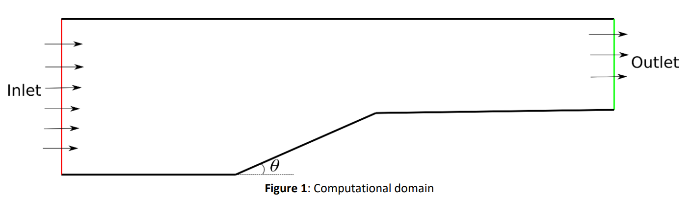
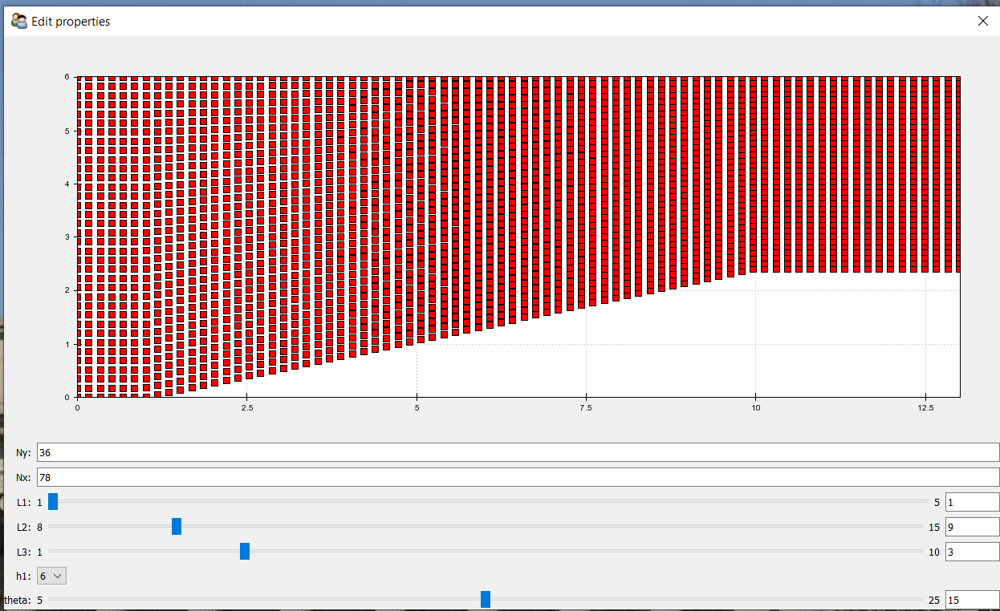
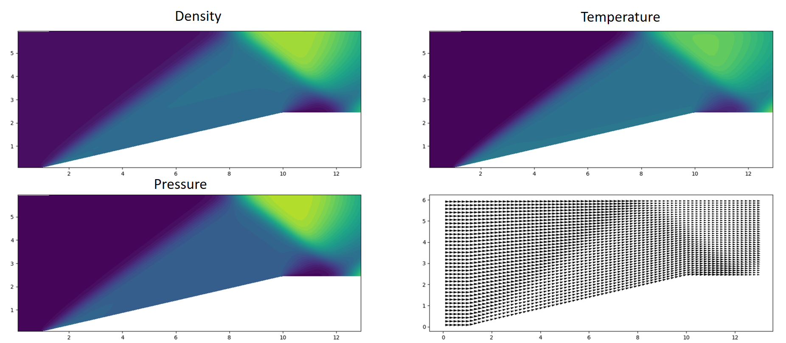
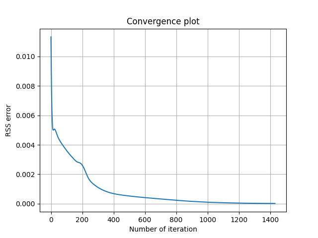
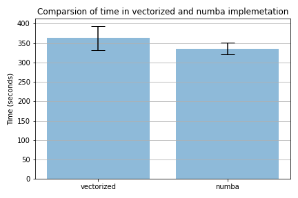

# Supersonic Flow Over An Inclined Surface

This project was developed as part of **AE6102 Parallel Scientific Computing and Visualization**, a graduate-level course at the Indian Institute of Technology Bombay (IIT Bombay).

**Course Instructor:** [Prof. Prabhu Ramachandran](https://www.aero.iitb.ac.in/~prabhu/)  
**Department:** Aerospace Engineering, IIT Bombay

## Project Overview

This project implements a numerical solver for simulating supersonic flow over an inclined wedge geometry. The solver uses finite volume methods with explicit time integration and includes multiple optimization strategies for parallel computing performance.

### Key Features

- **Finite Volume Method**: Implements Roe's approximate Riemann solver for flux calculation
- **Parallel Computing**: Multiple implementations with Numba JIT compilation for performance
- **Interactive Visualization**: TraitsUI-based GUI for parameter exploration
- **Automated Analysis**: Batch processing capabilities for parameter studies

## Project Structure

```
├── src/                           # Source code implementations
│   ├── wedge.py                   # Basic implementation
│   ├── wedge_numba.py             # Numba-optimized version
│   ├── wedge_numba_automat.py     # Automated Numba version
│   └── automate_wedge.py          # Batch processing script
├── visualization/                 # Interactive visualization
│   └── wedge_traits.py            # TraitsUI GUI application
├── figures/                       # Generated plots and results
├── requirements.txt               # Python dependencies
└── README.md                   
```

## Technical Implementation

### Governing Equations

The solver implements the **2D unsteady compressible Euler equations**:

```
∂U/∂t + ∂F/∂x + ∂G/∂y = 0
```

Where:
- **U** = [ρ, ρu, ρv, ρE]ᵀ (conservative variables)
- **F, G** = inviscid flux vectors
- **ρ** = density, **u,v** = velocity components, **E** = total energy

### Numerical Method

- **Spatial Discretization**: **Finite volume approach** with structured grid
- **Flux Calculation**: **Roe-FDS (Roe Flux Difference Splitting) scheme**
- **Time Integration**: Explicit forward Euler scheme
- **Boundary Conditions**: Supersonic inlet/outlet conditions

### Computational Domain

The computational domain represents a **2D channel with inclined wedge geometry**:



**Domain Structure:**
- **Top Wall**: Flat horizontal surface
- **Bottom Wall**: 
  - Flat inlet section (L1)
  - **Inclined wedge surface** at angle θ (L2) 
  - Flat outlet section (L3)
- **Inlet Boundary**: Supersonic flow entering from left (marked in red)
- **Outlet Boundary**: Flow exiting to right (marked in green)

**Key Features:**
- **Wedge Angle (θ)**: Configurable inclination angle (5° - 25°)
- **Channel Height**: Variable height (h1) above the wedge
- **Flow Direction**: Left-to-right supersonic flow
- **Shock Formation**: Oblique shock waves generated by the inclined surface

## Installation and Setup

### Prerequisites

- Python 3.8 or higher
- Virtual environment (recommended)

### Installation

1. **Clone the repository:**
   ```bash
   git clone <repository-url>
   cd AE6102-Parallel-Scientific-Computing-and-Visualization
   ```

2. **Create and activate virtual environment:**
   ```bash
   python -m venv venv
   source venv/bin/activate  # On Windows: venv\Scripts\activate
   ```

3. **Install dependencies:**
   ```bash
   pip install -r requirements.txt
   ```

## Usage

### Interactive Visualization

Launch the interactive GUI for parameter exploration:

```bash
python visualization/wedge_traits.py
```

The GUI allows real-time modification of:
- Grid resolution (Nx, Ny)
- Domain dimensions (L1, L2, L3)
- Wedge height (h1)
- Wedge angle (θ)



### Command Line Execution

Run simulations with different optimization levels:

```bash
# Basic implementation
python src/wedge.py

# Numba-optimized version
python src/wedge_numba.py

# Automated batch processing
python src/automate_wedge.py
```

### Performance Comparison

Compare different implementations:

```bash
python src/wedge_numba_automat.py
```

## Results and Analysis

### Flow Field Visualization



### Convergence Analysis

Convergence studies demonstrate the numerical stability and accuracy of the method:



### Performance Benchmarking

Comparative analysis of different optimization strategies:




